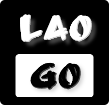

# laogo

[](https://app.netlify.com/sites/laogo/deploys)
 [](https://david-dm.org/oGsLP/laogo)

> Lao logo generator



**We aimed at provide some excellent designs of logo, with theirs generators. Still updating, more styles to be seen!**

* A SPA @Vue/cli@3.8 project
* using vue-router, vuex, bootstrap-vue
* jest unit and nightwatch e2e tests, travis ci/coveralls to be added

click [*here*](laogo.netlify.com) to take a glance at our site!

| 序号  | 名称                | 预览                                                       | 添加日期        |
|:---:|:-----------------:|:--------------------------------------------------------:|:-----------:|
| 1   | laogo generator   |  | 19.05.11    |
| 2   | digital generator | to be done....                                           | to be added |

## Build Setup

```bash
# install dependencies
npm install

# serve with hot reload at localhost:8080
npm run serve

# build for production with minification
npm run build

# build for production and view the bundle analyzer report
npm run build --report

# run unit tests
npm run test:unit
/
npm run test

# run e2e tests
npm run test:e2e 

# send coveralls
npm run coveralls
```

For a detailed explanation on how things work, check out the [guide](http://vuejs-templates.github.io/webpack/) and [docs for vue-loader](http://vuejs.github.io/vue-loader).
